# Content Pipeline Architecture — C4 Mermaid Diagrams

Precise end-to-end flow diagrams of the CrawlReady content pipeline infrastructure, based on `content-pipeline-infrastructure.md`. Uses C4 model levels: Context → Container → Component, plus detailed request-flow and decision diagrams.

---

## 1. C4 Context Diagram — System Landscape

Who interacts with CrawlReady and what are the external boundaries.

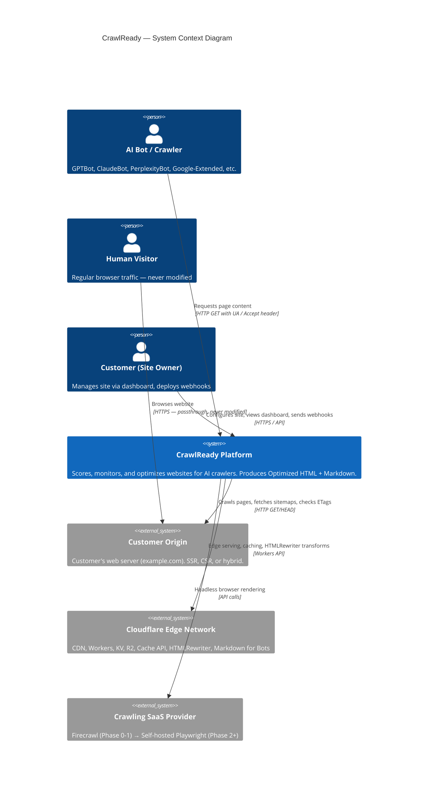

---

## 2. C4 Container Diagram — Three Planes

The three architectural planes and their containers.

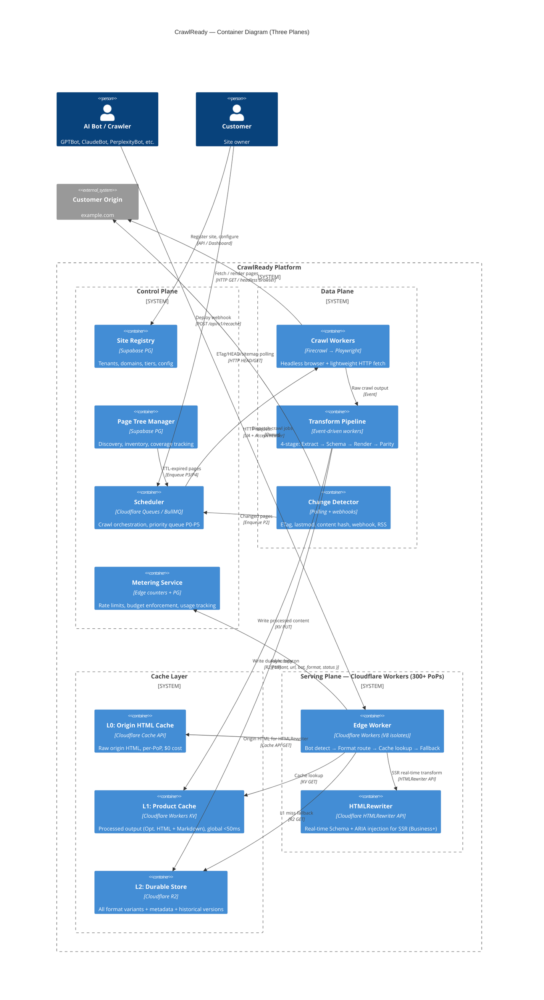

---

## 3. C4 Component Diagram — Edge Worker (Serving Plane)

Detailed internals of the Edge Worker — the entry point for every bot request.

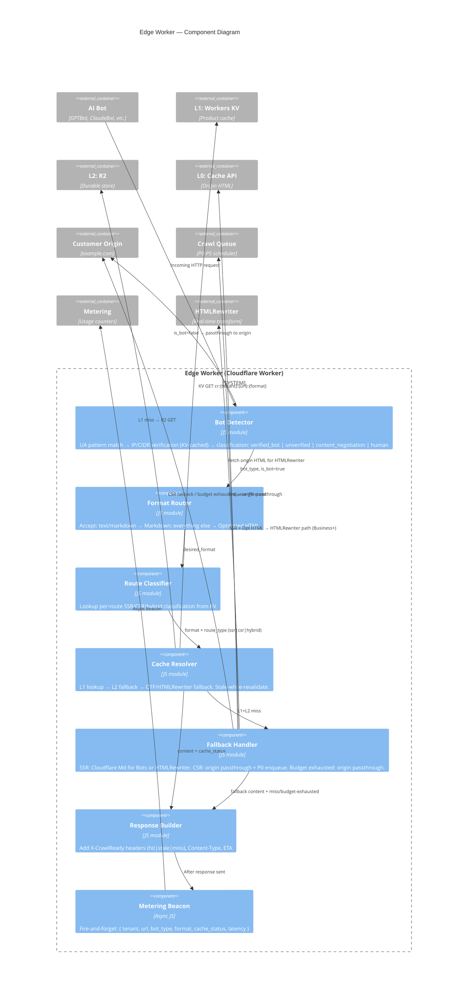

---

## 4. C4 Component Diagram — Data Plane (Content Transformation)

The 4-stage transformation pipeline in detail.

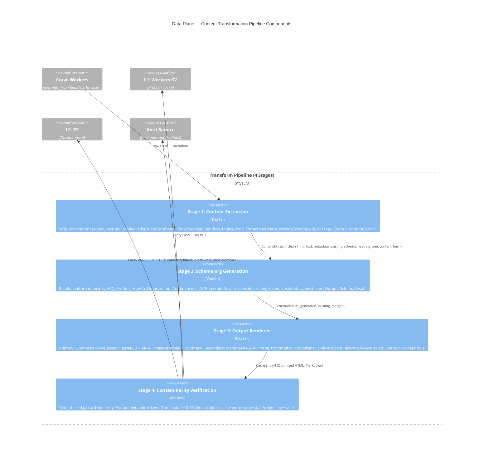

---

## 5. End-to-End Flow — Bot Request (Complete Path)

Full flowchart from incoming bot request to response, covering all decision points.

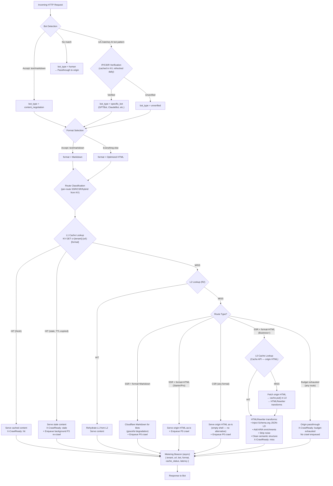

---

## 6. Request Flow — Level 2 (Middleware SDK)

Sequence diagram for when the customer uses the CrawlReady middleware SDK.

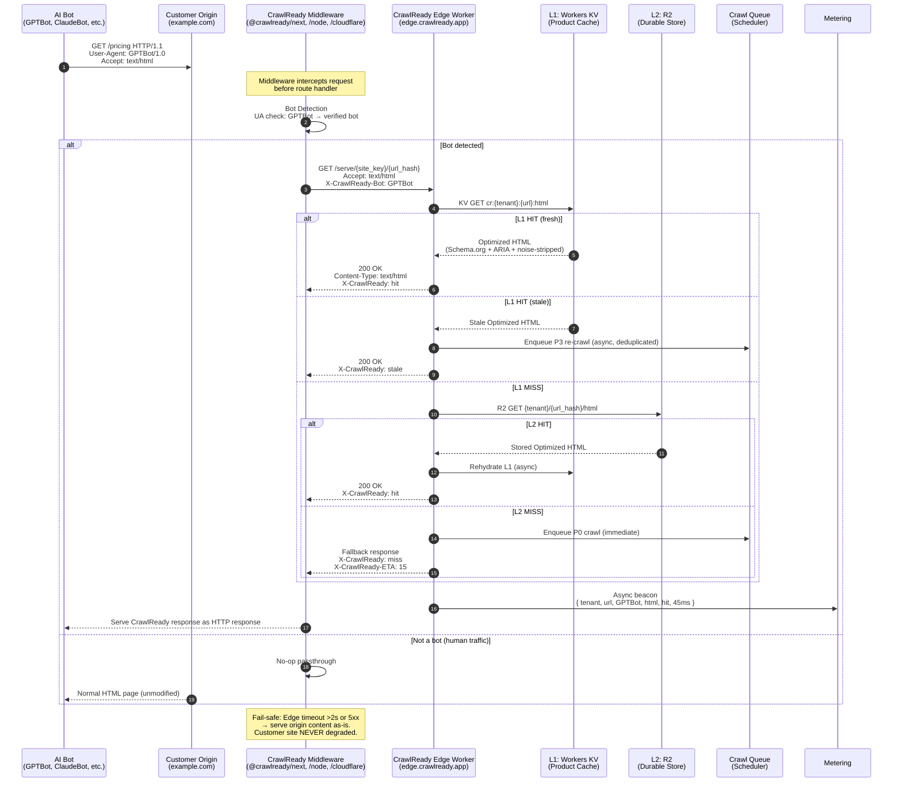

---

## 7. Request Flow — Level 3 (DNS Proxy)

Sequence diagram for when the customer uses DNS CNAME proxy to CrawlReady.

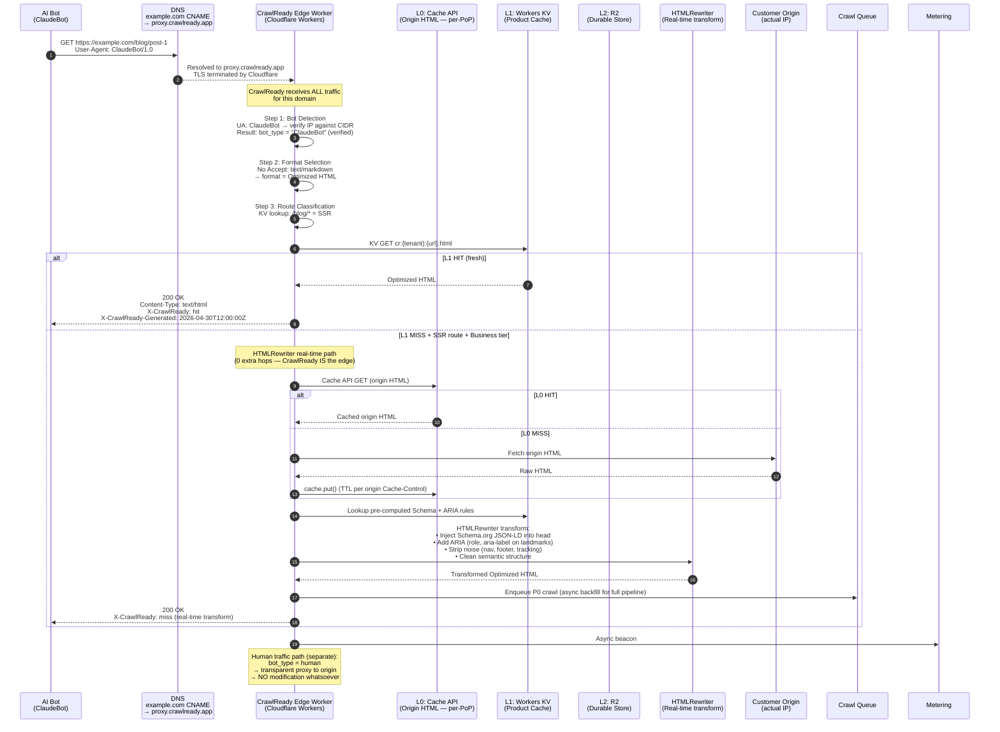

---

## 8. Request Flow — Level 3: Human vs Bot Routing

Shows how DNS proxy mode handles both traffic types.

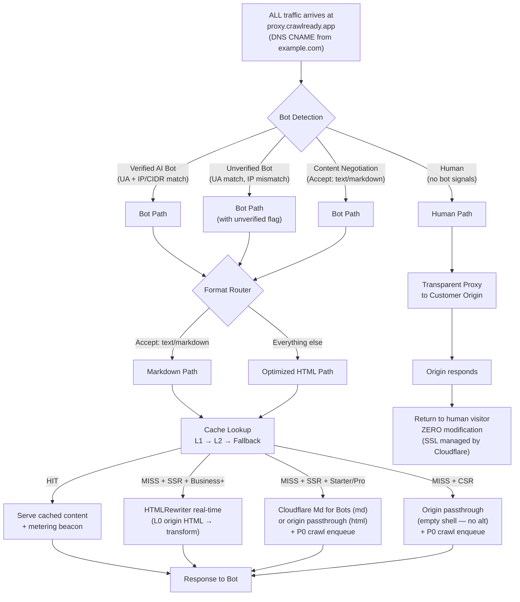

---

## 9. Hybrid Strategy — Pre-Crawl vs On-the-Fly Decision Flow

The tier-aware algorithm that determines which pages get pre-crawled vs served on-the-fly.

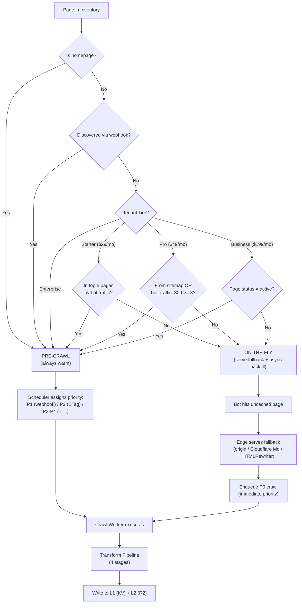

---

## 10. Content Discovery & Ingestion Pipeline

End-to-end from site registration through page inventory.

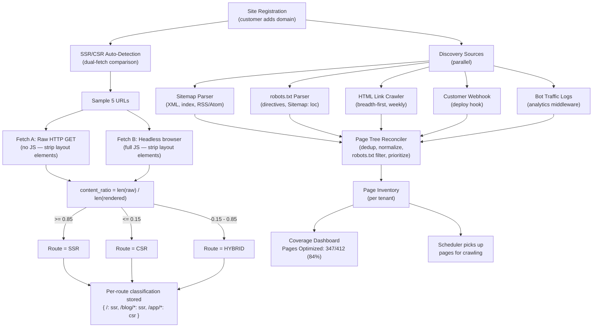

---

## 11. Cache Topology — 4-Tier Lookup & Write Flow

```mermaid
flowchart TD
    subgraph Read_Path ["Read Path (Bot Request)"]
        R1["Edge Worker receives<br/>bot request"] --> R2{"L1: Workers KV<br/>Global <50ms"}

        R2 -->|"HIT (fresh)"| R3["Serve immediately<br/>X-CrawlReady: hit"]
        R2 -->|"HIT (stale)"| R4["Serve stale<br/>+ enqueue P3 re-crawl<br/>X-CrawlReady: stale"]
        R2 -->|"MISS"| R5{"L2: R2<br/>(Durable Store)"}

        R5 -->|"HIT"| R6["Rehydrate L1<br/>+ Serve"]
        R5 -->|"MISS"| R7{"L0: Cache API<br/>(Origin HTML — per-PoP)"}

        R7 -->|"HIT + SSR + Business+"| R8["HTMLRewriter transform<br/>(real-time Schema + ARIA)"]
        R7 -->|"MISS"| R9["Fetch origin HTML<br/>→ cache.put() in L0"]
        R9 --> R8

        R5 -->|"MISS + CSR or no HTMLRewriter"| R10["L3: On-the-Fly Generation<br/>Serve fallback<br/>+ Enqueue P0 crawl"]
    end

    subgraph Write_Path ["Write Path (Pipeline Output)"]
        W1["Transform Pipeline<br/>produces CacheEntry[]"] --> W2{"Content Parity<br/>Jaccard >= 0.90?"}

        W2 -->|"PASS"| W3["Write to L2 (R2)<br/>+ metadata + parity report"]
        W3 --> W4["Propagate to L1 (KV)<br/>key: cr:{tenant}:{url}:{format}"]

        W2 -->|"FAIL"| W5["Block cache write<br/>Serve stale or origin<br/>Log + alert customer"]
    end

    subgraph Invalidation ["Cache Invalidation (4 Triggers)"]
        I1["Customer webhook<br/>POST /api/v1/recache"] --> I5["Purge L0 + L1<br/>+ P1 re-crawl<br/>(< 30s)"]
        I2["ETag mismatch<br/>(content change detected)"] --> I6["Purge L0 + L1<br/>+ P2 re-crawl<br/>(< 5min)"]
        I3["TTL expiry"] --> I7["L1 auto-expires<br/>L0 short-TTL"]
        I4["Pipeline version upgrade"] --> I8["Background re-process<br/>from L2 stored HTML<br/>(hours, low-priority)"]
    end
```

---

## 12. Change Detection Hierarchy

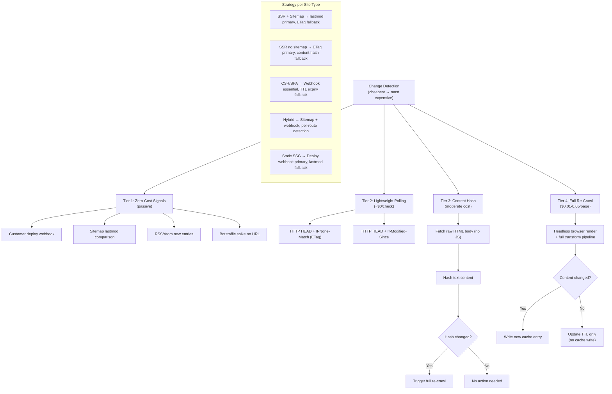

---

## 13. Resilience & Failure Modes

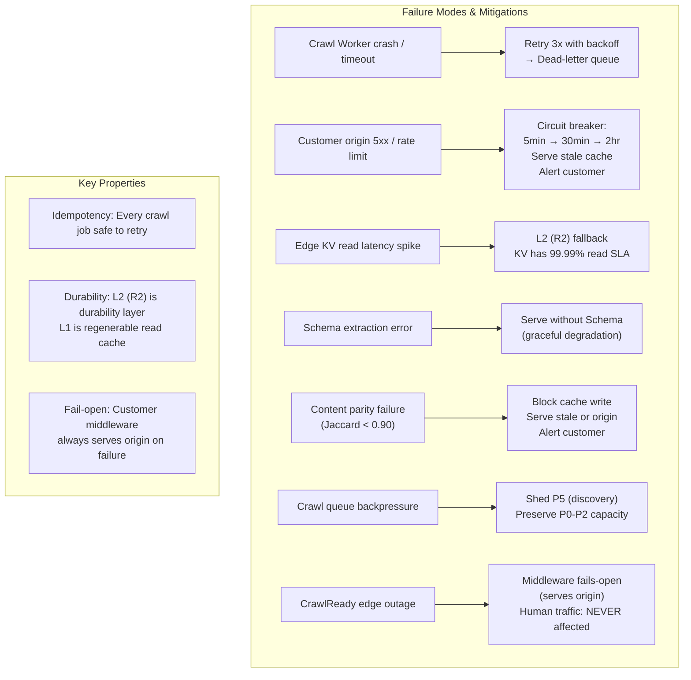

---

## 14. Phase Evolution — Technology Migration Path

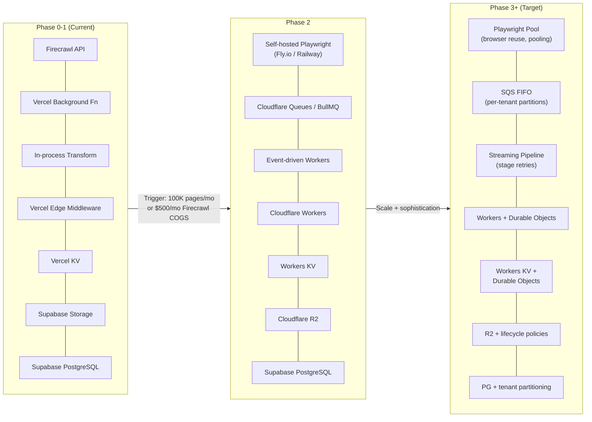

---

## 15. Crawl Orchestration — Priority Queue & Worker Pool

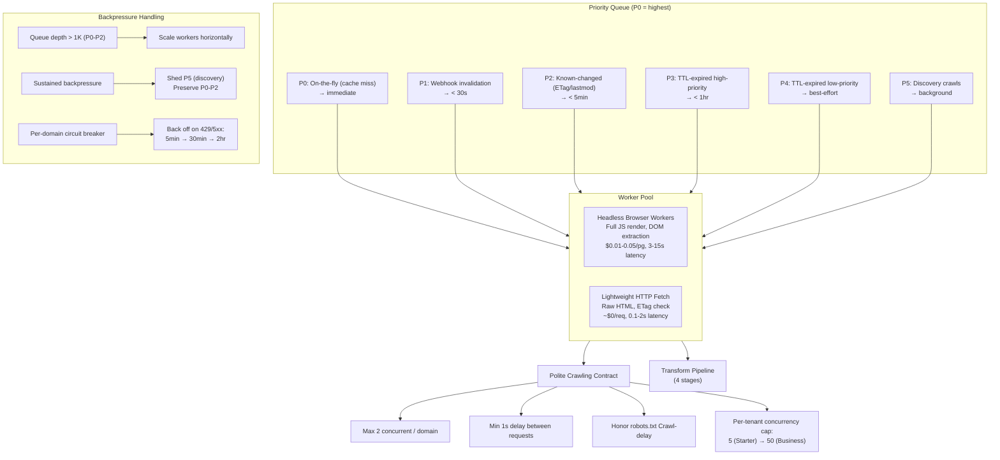

---

## 16. SSR HTMLRewriter Path — Detailed Flow (Business+ Tier)

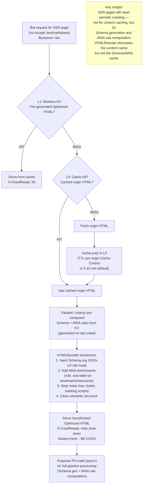

---

## Legend

| Diagram | C4 Level | Purpose |
|---|---|---|
| §1 Context | L1 - Context | System boundaries and external actors |
| §2 Container | L2 - Container | Three planes and their containers |
| §3 Edge Worker Components | L3 - Component | Internals of the serving plane edge worker |
| §4 Data Plane Components | L3 - Component | Transform pipeline 4-stage internals |
| §5 End-to-End Flow | Flow | Complete bot request path with all decisions |
| §6 Level 2 Middleware | Sequence | Middleware SDK integration request flow |
| §7 Level 3 DNS Proxy | Sequence | DNS proxy integration request flow |
| §8 Human vs Bot Routing | Flow | DNS proxy traffic bifurcation |
| §9 Hybrid Strategy | Flow | Pre-crawl vs OTF tier-aware decision tree |
| §10 Discovery Pipeline | Flow | Site registration through page inventory |
| §11 Cache Topology | Flow | 4-tier read/write/invalidation paths |
| §12 Change Detection | Flow | Tiered detection hierarchy per site type |
| §13 Resilience | Flow | Failure modes and mitigations |
| §14 Phase Evolution | Flow | Technology migration path Phase 0→3+ |
| §15 Crawl Orchestration | Flow | Priority queue, worker pool, backpressure |
| §16 HTMLRewriter Path | Flow | Business+ SSR real-time transform detail |
