# Infrastructure Architecture — Mermaid Diagrams

Precise diagrams of CrawlReady's Phase 0 infrastructure, scan workflow, analytics/ingest pipeline, and cross-cutting concerns. Complements [diagrams-content-pipeline.md](./diagrams-content-pipeline.md) (which covers the Phase 2+ content pipeline).

---

## 1. Phase 0 System Topology — C4 Context

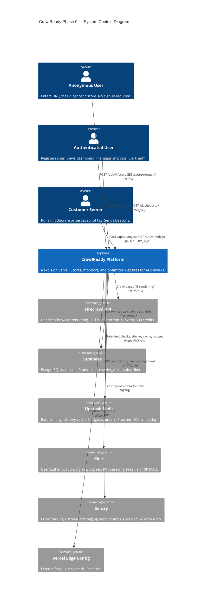

---

## 2. Phase 0 Container Diagram — Two Data Planes

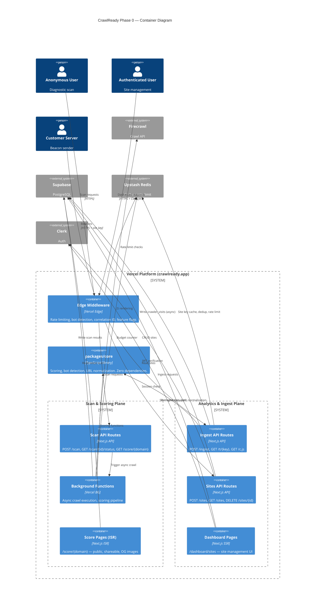

---

## 3. Scan Workflow — State Machine

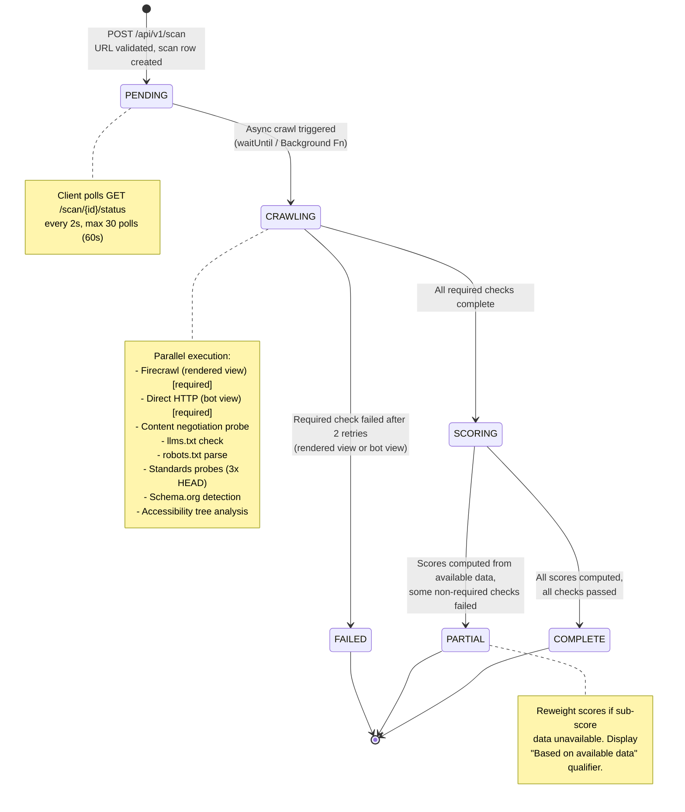

---

## 4. Scan Workflow — End-to-End Sequence

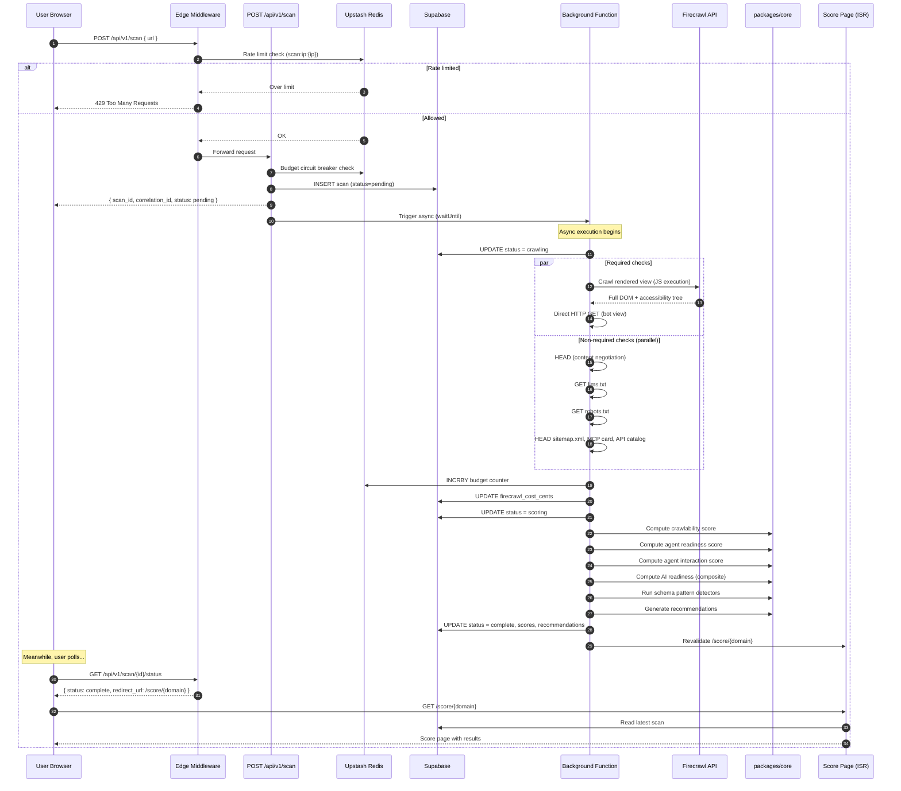

---

## 5. Analytics Ingest Pipeline — End-to-End Flow

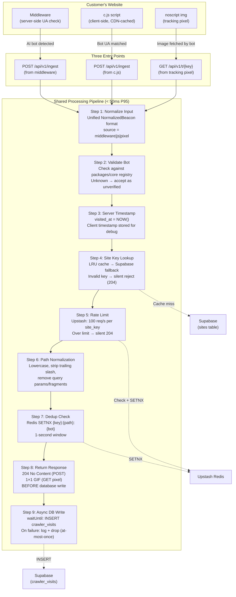

---

## 6. Analytics Ingest — Dual Integration Decision

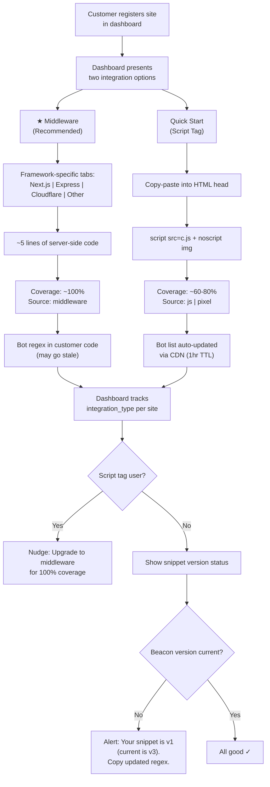

---

## 7. Site Key Lifecycle

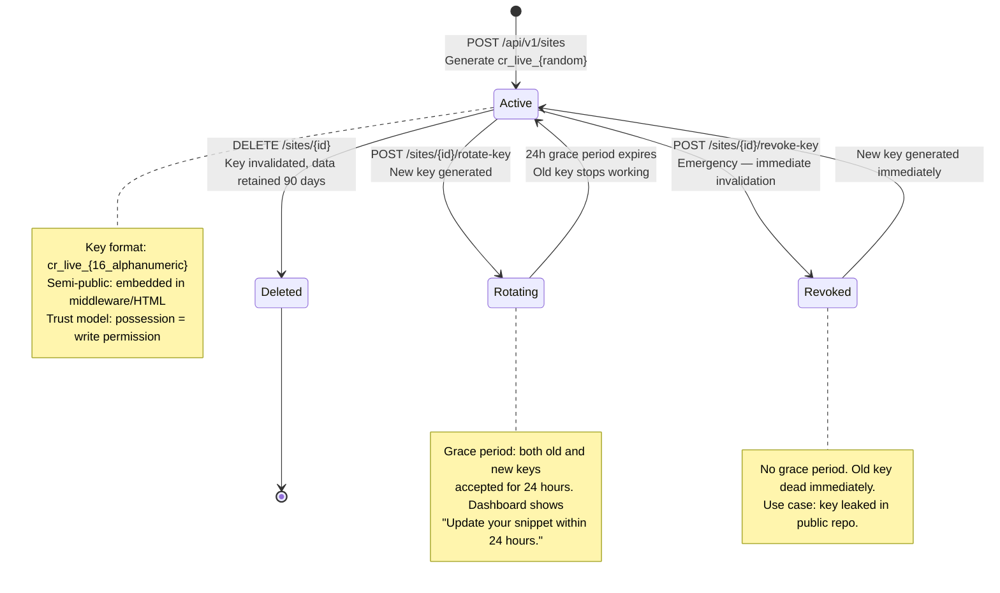

---

## 8. Rate Limiting — 3-Layer Flow

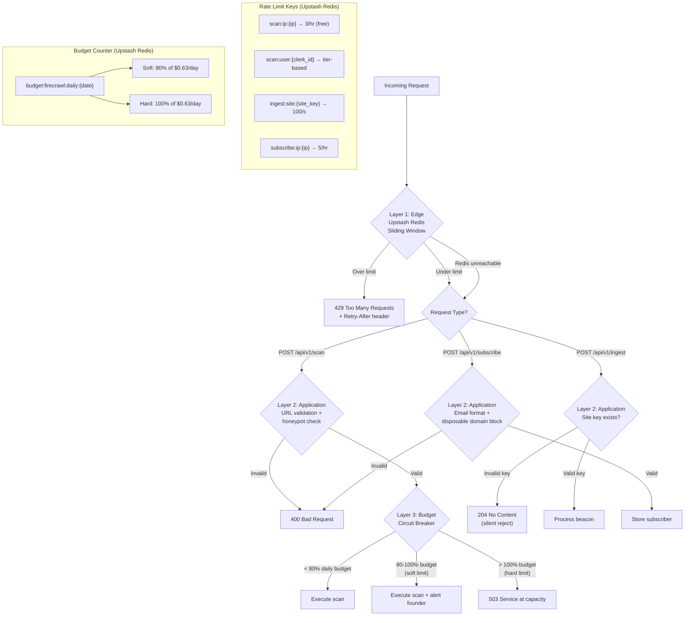

---

## 9. Score Page Architecture

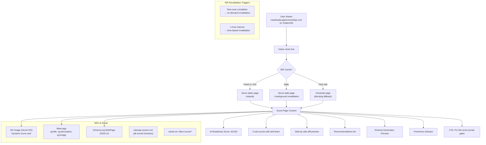

---

## 10. Observability — Correlation ID Flow

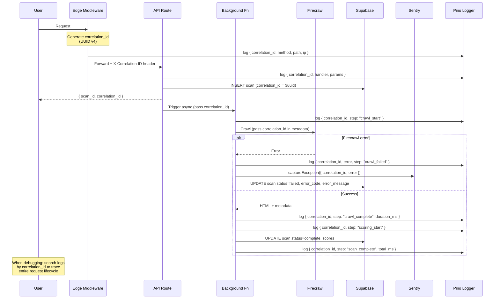

---

## 11. Data Aggregation — Phase Evolution

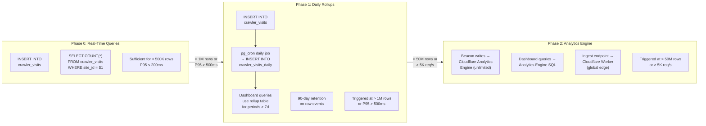

---

## 12. Alert System — Computation Flow (Phase 1)

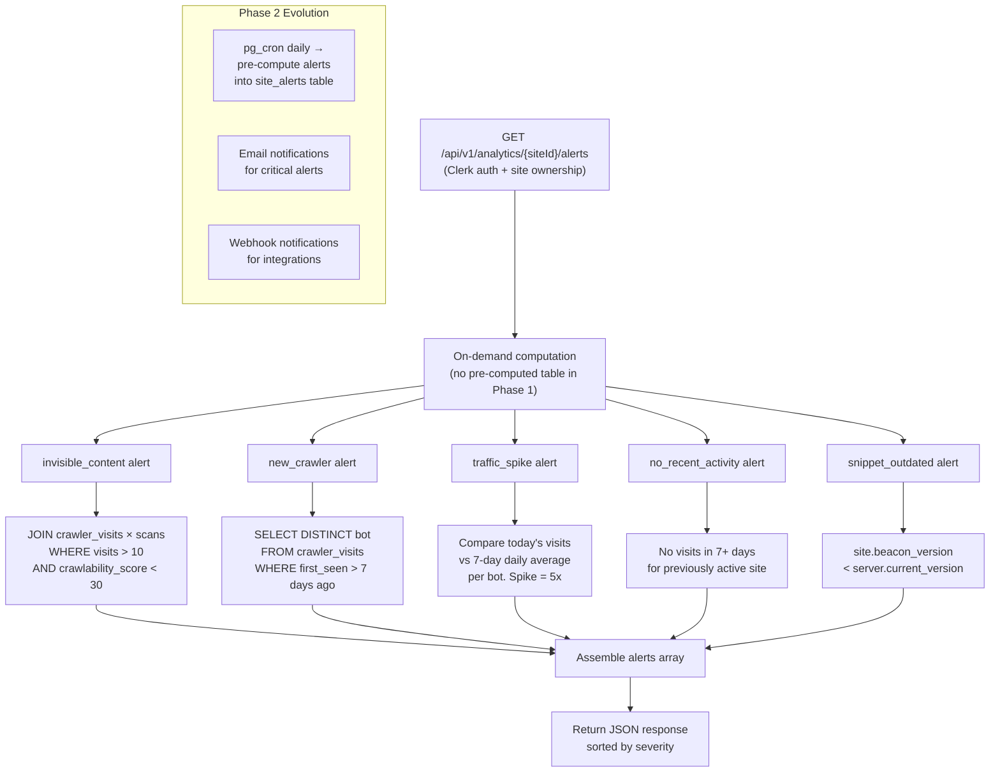

---

## 13. Infrastructure Dependencies — Failure Impact

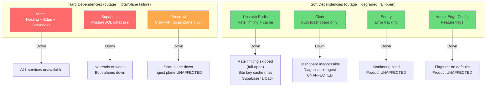

---

## 14. Deployment Pipeline

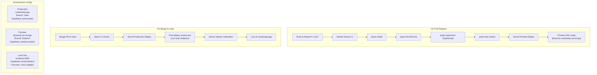

---

## 15. packages/core — Dependency Graph

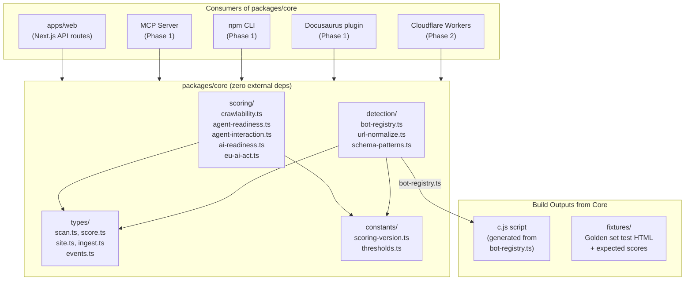

---

## Legend

| Diagram | Level | Purpose |
|---|---|---|
| §1 Phase 0 Context | C4 L1 | System boundaries, all external services |
| §2 Phase 0 Containers | C4 L2 | Two data planes, internal containers |
| §3 Scan State Machine | State | Scan lifecycle states and transitions |
| §4 Scan Sequence | Sequence | End-to-end scan from request to score page |
| §5 Ingest Pipeline | Flow | 9-step beacon processing with all entry points |
| §6 Dual Integration | Flow | Customer onboarding decision tree |
| §7 Site Key Lifecycle | State | Key create/rotate/revoke/delete states |
| §8 Rate Limiting | Flow | 3-layer rate limiting with budget breaker |
| §9 Score Page | Flow | ISR, OG images, SEO, revalidation |
| §10 Observability | Sequence | Correlation ID tracing through all layers |
| §11 Aggregation | Flow | Phase 0→1→2 data aggregation evolution |
| §12 Alert System | Flow | On-demand alert computation (Phase 1) |
| §13 Dependencies | Flow | Hard vs soft dependencies, failure impact |
| §14 Deployment | Flow | CI/CD pipeline, environments |
| §15 packages/core | Flow | Core library dependency graph and consumers |
