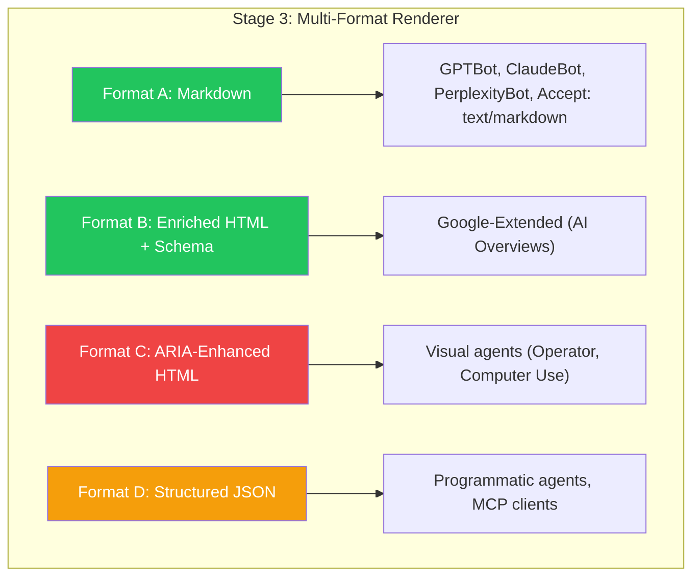
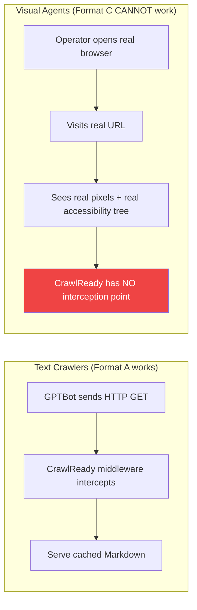
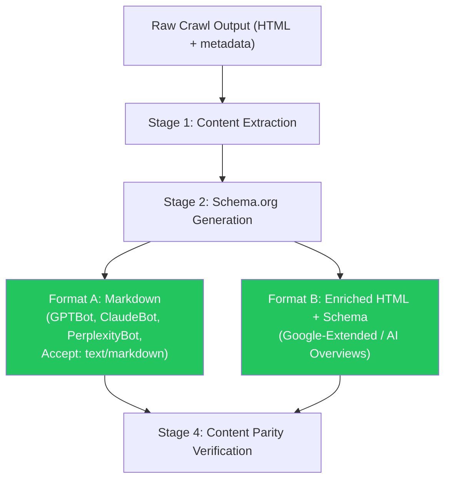
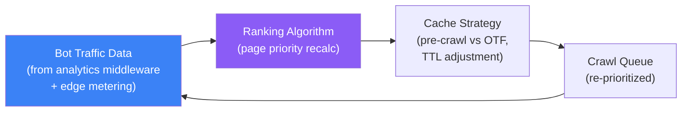
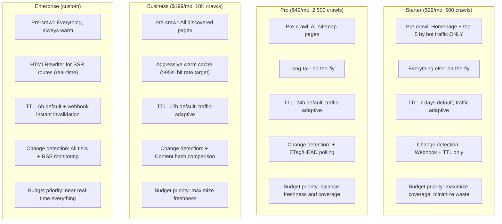

# Critical Analysis: Content Pipeline Architecture

Principal-engineer review of `content-pipeline-infrastructure.md` (Parts 1 & 2). Evaluates every section through two lenses: (1) is it technically sound? (2) does the customer actually need this? Identifies gaps, unjustified complexity, and areas requiring deeper design.

---

## Verdict Summary

The architecture is structurally sound but suffers from **over-engineering in the wrong places** and **under-specification in the places that matter**. Four specific problems:

1. **Two of four output formats have no real consumer.** Format C (ARIA HTML) and Format D (Structured JSON) are built to have them, not because anything requests them.
2. **The caching strategy is tier-blind.** A $29/mo Starter customer and a $199/mo Business customer get the same hybrid algorithm. They shouldn't.
3. **Discovery is over-exposed as a feature.** Customers don't care about page tree management. They care about coverage ("are all my pages optimized?").
4. **Traffic-adaptive intelligence is missing.** The architecture has static priority logic. It should learn from actual bot traffic patterns and dynamically shift resources.

---

## 1. Format Renderer Critique: "We Should Not Make Something to Have Them"

### The Current Proposal (4 Formats)



### Format A (Markdown) — JUSTIFIED

**Who consumes it:** GPTBot, ClaudeBot, PerplexityBot, OAI-SearchBot, any client sending `Accept: text/markdown`.

**Evidence:**
- These crawlers fetch raw HTML and parse it. They cannot render JS. Serving them pre-rendered clean Markdown is the core value proposition.
- Cloudflare's "Markdown for Agents" (Feb 2026) established `Accept: text/markdown` as a standard.
- Claude Code and OpenCode already send this header today.
- GPTBot, ClaudeBot, and PerplexityBot represent ~35% of all AI bot traffic combined.

**Verdict:** This is the product. Ship it.

### Format B (Enriched HTML + Schema.org) — JUSTIFIED

**Who consumes it:** Google-Extended (powers AI Overviews).

**Evidence:**
- Google-Extended uses Google's Web Rendering Service (headless Chromium). It renders JS and processes HTML natively. Sending it Markdown is suboptimal.
- FAQPage Schema makes sites 3.2x more likely to appear in AI Overviews (Citedify, 2026).
- Attribute-rich Schema achieves 61.7% citation rate vs. 41.6% for generic (Growth Marshal, p = .012).
- Google-Extended is the single largest AI crawler by traffic share (part of Googlebot's 34.6-38.7%).
- Google AI Overviews is the #1 AI citation channel by volume.

**Verdict:** High-impact. The Schema generation engine is CrawlReady's strongest technical differentiator. Ship it.

### Format C (ARIA-Enhanced HTML) — NOT JUSTIFIED. REMOVE.

**Who supposedly consumes it:** Visual agents (OpenAI Operator, Anthropic Computer Use, Perplexity Comet).

**Why it has no consumer:**

Visual agents do not consume cached/proxy content. They open a **real browser**, visit the **real URL**, see **real pixels**, and navigate via the **real accessibility tree** of the live page. They are indistinguishable from a human user at the HTTP level.

The delivery problem:



- **Operator** uses a CUA (Computer Using Agent) model that processes screenshots. It controls a real browser session. CrawlReady's middleware/proxy never sees the request because Operator IS the browser.
- **Computer Use** literally operates the desktop. It's not an HTTP client — it's a screen viewer.
- **There is no User-Agent header to detect.** Visual agents don't identify themselves differently in HTTP requests. They appear as Chrome/Safari.
- **Even at Level 3 (DNS proxy):** CrawlReady could theoretically intercept the request, but serving modified HTML to a visual agent defeats the purpose — the agent needs to see the REAL page to interact with the real UI.

**What the Agent Interaction Score actually measures:** How well the customer's *own site* works for visual agents. It's a diagnostic metric. CrawlReady SCORES this but cannot FIX it via cached content — the fix requires the customer to improve their own HTML (add ARIA labels, use semantic elements, etc.).

**Recommendation:** Remove Format C from the pipeline. Keep the Agent Interaction Score as a diagnostic-only metric with recommendations. The score has value; the format does not.

**Cost saved:** ~25% of pipeline compute and storage per page. One fewer format variant to generate, cache, invalidate, and serve.

### Format D (Structured JSON) — NOT JUSTIFIED TODAY. DEFER.

**Who supposedly consumes it:** Programmatic agents, MCP clients.

**Why it has no consumer today:**

- **MCP clients call MCP server tools, not cached JSON endpoints.** MCP is a protocol for tool invocation, not a content format. A CrawlReady MCP server (Phase 1) would call CrawlReady's own API and return structured data — it doesn't consume pre-cached JSON from the edge.
- **No AI crawler today requests JSON.** There is no `Accept: application/json` convention for AI content crawling.
- **Commerce agents (ACP, UCP)** call product APIs directly. They don't crawl websites for JSON.
- **The only real use case** is CrawlReady's own API (`GET /api/v1/score/{domain}`) returning structured data — which already exists and doesn't require a per-page cached JSON format.

**Recommendation:** Defer Format D to Phase 3+ when programmatic agent standards emerge. If it becomes needed, the pipeline can add it as a stage — the extraction and Schema generation (Stage 1 + 2) already produce all the data needed.

### Revised Pipeline: 2 Formats



**Impact:** Pipeline complexity drops ~50%. Cache storage drops ~50%. Two formats to test, two to invalidate, two to serve. Every format has a real consumer. The edge format router becomes a simple binary decision:

```
Google-Extended? → Enriched HTML + Schema
Everything else? → Markdown
```

---

## 2. Discovery: The Customer Doesn't Care. Reframe It.

### The Problem with the Current Design

The architecture devotes significant space to discovery (sitemap parsing, breadth-first link crawling, RSS monitoring, robots.txt parsing). This is internally important but **zero customers will ever say "I need better page discovery."**

### What the Customer Actually Wants

A customer signs up and thinks:

> "I have a website with 500 pages. I want all of them optimized for AI. How do I make that happen?"

They don't want to understand discovery pipelines. They want:

1. **"How many of my pages are covered?"** → A coverage metric (e.g., "347/500 pages optimized")
2. **"Are my important pages done?"** → They know which pages matter (pricing, docs, features)
3. **"Is my new content automatically picked up?"** → They want set-and-forget, not babysitting

### Reframe: "Coverage" not "Discovery"

| Current framing (internal plumbing) | Better framing (customer value) |
|---|---|
| "Page Tree Manager discovers 500 URLs via sitemap" | "CrawlReady covers 500 of your pages" |
| "Breadth-first link crawler found 23 orphan pages" | "We found 23 pages not in your sitemap that bots are visiting" |
| "Sitemap polling frequency: every 6h" | "New pages are picked up within 6 hours" |
| "RSS feed monitoring" | (customer doesn't need to know this exists) |

### What to Keep, What to Hide

- **Keep the discovery mechanisms** (sitemap, link crawl, webhook, bot traffic signals). They're good engineering.
- **Expose to the customer:** Coverage percentage, list of covered pages, list of uncovered pages, "time to first optimization" for new content.
- **Do NOT expose:** Discovery sources, polling frequencies, reconciliation logic. This is infrastructure, not product surface.

### Gap: No Coverage Dashboard Design

The architecture doesn't specify how the customer sees their coverage. Add to the design:

```
Dashboard → "Site Coverage"
┌─────────────────────────────────────────────────┐
│  Pages Optimized: 347 / 412 (84%)               │
│  [████████████████░░░░] 84%                      │
│                                                   │
│  ⚠ 65 pages not yet optimized:                   │
│    - 42 discovered today (processing...)          │
│    - 18 returned errors on crawl                  │
│    - 5 blocked by robots.txt                      │
│                                                   │
│  New content pickup: ~6 hours (via sitemap)       │
│  Fastest: add deploy webhook → < 30 seconds       │
│  [Configure webhook →]                            │
└─────────────────────────────────────────────────┘
```

---

## 3. Traffic-Adaptive Caching: A Critical Missing Piece

### The Gap

The current `should_pre_crawl()` algorithm uses a static threshold (`bot_traffic_30d >= 5`). It doesn't adapt. Pages that suddenly start getting heavy bot traffic don't get priority until the next scheduling cycle happens to re-evaluate them.

### What's Needed: A Feedback Loop



### Concrete Mechanism: Traffic-Weighted Priority

```python
def compute_page_priority(page, tenant):
    """
    Dynamic priority based on actual bot traffic.
    Runs periodically (hourly for Pro+, daily for Starter).
    """
    # Base priority from sitemap (0.0-1.0)
    base = page.sitemap_priority or 0.5

    # Traffic signal: normalized bot visit count (0.0-1.0)
    max_traffic = max(p.bot_traffic_30d for p in tenant.pages) or 1
    traffic_signal = page.bot_traffic_30d / max_traffic

    # Recency signal: recently visited pages get boost
    days_since_last_bot_visit = (now() - page.last_bot_visit_at).days
    recency_boost = max(0, 1.0 - (days_since_last_bot_visit / 30))

    # Combined priority
    priority = (0.3 * base) + (0.5 * traffic_signal) + (0.2 * recency_boost)

    return clamp(priority, 0.0, 1.0)
```

### Traffic-Adaptive TTL

Pages receiving heavy bot traffic should have shorter TTLs (fresher content matters more when bots visit frequently). Pages with zero bot traffic should have longer TTLs (no point refreshing what nobody reads).

| Bot visits / 30 days | TTL Multiplier | Effect on Starter (7d default) |
|---|---|---|
| 0 | 2.0x | 14 days (why refresh what bots don't visit?) |
| 1-10 | 1.0x | 7 days (default) |
| 11-50 | 0.5x | 3.5 days |
| 50+ | 0.25x | ~2 days |

**This alone could reduce crawl costs by 30-40%** — by extending TTLs on unvisited pages and concentrating freshness budget on pages bots actually care about.

---

## 4. Tier-Based Strategy: One Algorithm Does NOT Fit All

### The Problem

The current architecture applies the same hybrid pre-crawl/on-the-fly algorithm to all tiers. A Starter customer paying $29/mo with 500 fresh crawls gets the same treatment as a Business customer paying $199/mo with 10K crawls. This is wrong because:

- **Starter has a tight crawl budget.** Every unnecessary pre-crawl is wasted budget.
- **Business has budget for aggressive pre-crawling.** They're paying for freshness and coverage.
- **Enterprise expects near-real-time.** They want webhook-driven instant updates.

### Tier-Differentiated Strategy



### Revised `should_pre_crawl()` — Tier-Aware

```python
def should_pre_crawl(page, tenant):
    # Universal: always pre-crawl homepage
    if page.url == tenant.homepage:
        return True

    # Universal: always pre-crawl webhook-pushed pages
    if page.discovered_via == 'webhook':
        return True

    if tenant.tier == 'starter':
        # Starter: only pre-crawl top N pages by bot traffic
        top_pages = get_top_pages_by_bot_traffic(tenant, limit=5)
        return page.url in top_pages

    elif tenant.tier == 'pro':
        # Pro: pre-crawl sitemap pages + bot-visited pages
        if page.discovered_via == 'sitemap':
            return True
        if page.bot_traffic_30d >= 3:
            return True
        return False

    elif tenant.tier == 'business':
        # Business: pre-crawl everything discovered
        if page.status == 'active':
            return True
        return False

    elif tenant.tier == 'enterprise':
        # Enterprise: pre-crawl everything, always
        return True

    return False
```

---

## 5. Stale & Removed Content: What Happens to Dead Pages?

### Gap: No "Decay" Strategy

The current design has a binary model: page is `active` or `removed`. Missing: what about pages that exist but nobody visits?

### The Problem

A customer has 5,000 pages. 200 of them haven't received a single bot visit in 90 days. Under the current design, the system keeps pre-crawling and refreshing these 200 pages on their TTL cycle, burning crawl budget on content nobody reads.

### Proposed: Cache Decay Tiers

| Bot visits in last 90 days | Status | Cache behavior |
|---|---|---|
| 10+ | **Hot** | Normal TTL, pre-crawl priority |
| 1-9 | **Warm** | Extended TTL (2x default), pre-crawl if budget allows |
| 0 | **Cold** | On-the-fly only, 30-day TTL, no proactive refresh |
| 0 for 180+ days | **Frozen** | Cache retained but never refreshed. Serve stale-if-requested. |

### Removed Pages: Keep or Purge?

**Current proposal:** 7-day retention, then hard-delete.

**Better approach:**

```
Page removed from sitemap / returns 404
  → Serve 410 to bots (de-index signal)
  → Keep cache for 30 days (not 7)
    Why: Customer may have accidentally removed it.
    Why: Bots may still visit it from old indexes.
  → After 30 days with no bot visits: hard-delete
  → After 30 days with bot visits: alert customer
    "This page was removed but bots are still visiting it.
     Do you want to redirect it?"
```

---

## 6. HTMLRewriter for SSR: Under-Specified

### Gap

The architecture proposes HTMLRewriter as a "zero-cache real-time path" for SSR sites but doesn't answer critical questions:

1. **How does CrawlReady know if a site is SSR vs CSR?** There's no auto-detection specified. Does the customer declare it? Does CrawlReady probe the origin HTML and check if it contains substantial content?

2. **Can HTMLRewriter and pre-generated cache coexist per-route?** A hybrid site may have SSR marketing pages and CSR dashboard routes. The architecture needs per-route strategy selection.

3. **Schema injection via HTMLRewriter requires pre-computed Schema.** The Schema generation engine (Stage 2) needs to have already analyzed the page content and produced JSON-LD. Where is this Schema stored if there's no cache? Does HTMLRewriter fetch it from KV on every request?

### Proposed Answer to #3

```
Bot request for SSR page
  → Edge worker fetches origin HTML
  → Parallel: lookup pre-computed Schema from KV
    (Schema was generated on last crawl and stored separately)
  → HTMLRewriter injects Schema into <head>
  → HTMLRewriter strips noise elements
  → Serve transformed HTML
```

This means SSR pages still need periodic crawling — not for content caching, but for Schema generation. The HTMLRewriter path eliminates the content cache but not the Schema cache.

---

## 7. On-the-Fly Fallback: What Does the Bot Actually See?

### Gap

The architecture says:
- SSR sites: serve lightweight Markdown conversion of raw-fetched HTML
- CSR sites: serve origin HTML as-is

But this raises a customer-facing question: **"A bot visited my site and got unoptimized content. Is that counted against my crawl budget?"**

### Decisions Needed

| Question | Current answer | Recommended answer |
|---|---|---|
| Does a cache miss (OTF fallback) count as a fresh crawl? | Not specified | YES — the async backfill consumes a crawl credit |
| Does the bot see CrawlReady branding/headers during fallback? | X-CrawlReady: miss | Add `X-CrawlReady-ETA` header (estimated seconds to warm cache) |
| What if the customer's crawl budget is exhausted? | Not specified | Serve origin HTML passthrough with `X-CrawlReady: budget-exhausted` |
| Can the customer disable OTF entirely? | Not specified | YES — some customers may prefer "serve nothing from CrawlReady unless warm cache exists" |

---

## 8. Polite Crawling: Good but Incomplete

### Gap: No Customer-Facing Rate Limit Control

The polite crawling contract (2 concurrent, 1s delay) is good engineering. But the customer should be able to:

1. **Increase limits** for their own origin: "My site can handle 10 concurrent crawlers, go faster."
2. **Decrease limits** or set maintenance windows: "Don't crawl between 2am-4am UTC, that's our deploy window."
3. **Exclude paths:** "Don't crawl /admin/*, /api/*, /internal/*"

These are table-stakes for any crawling product. Not specified in the architecture.

---

## 9. Content Parity Verification: How Does It Actually Work?

### Gap: Algorithmic Specification Missing

"Text coverage: extracted ⊇ 95% of origin text" — how?

- What's the similarity algorithm? Cosine similarity on token vectors? Jaccard index on word sets? Exact substring matching?
- What about dynamic content (timestamps, session IDs, "5 minutes ago") that changes between origin fetch and cache generation?
- What about localized content (the origin serves French to a French IP, CrawlReady crawls from US)?
- What's the computational cost? This runs on every pipeline execution.

### Proposed: Practical Parity Check

```
1. Extract text tokens from origin rendered page
2. Extract text tokens from generated Markdown/HTML
3. Compute token overlap ratio (Jaccard index)
4. Exclude known-dynamic tokens (timestamps, session, CSRF)
5. Threshold: >= 0.90 overlap = PASS
6. On fail: diff the token sets, identify missing sections,
   log for investigation
```

---

## 10. Missing: What Happens at Scale with Sitemap Changes?

### Scenario

A large documentation site (5,000 pages) restructures its URL scheme. Every URL changes overnight. The sitemap now contains 5,000 new URLs and 5,000 old URLs are gone.

**What happens?**

- Page tree reconciler sees 5,000 removals + 5,000 additions
- 5,000 soft-deletes, 5,000 new page entries
- All 5,000 old cache entries become stale (pages no longer exist)
- 5,000 new pages need crawling from scratch

**The architecture doesn't handle this.** At the Starter tier (500 crawls/mo), it would take 10 months to re-crawl the site. At Business (10K crawls/mo), it's still a full month's budget for one site.

### Needed: Bulk Re-Crawl Mechanism

- Detect mass URL change (> 20% of inventory changed in one cycle)
- Alert customer: "Your site structure changed significantly. 5,000 new pages detected."
- Offer: one-time bulk re-crawl (charged as overage or included for Business+)
- Detect redirect patterns: if old URLs 301 to new URLs, update inventory instead of soft-delete + re-crawl

---

## 11. Missing: Pipeline Versioning & Re-Processing

The architecture mentions "Re-process (pipeline upgrade)" as an execution mode but doesn't specify:

1. How is pipeline version tracked? Per-tenant? Globally?
2. Does re-processing consume the customer's crawl budget? (It shouldn't — it's our upgrade, not their content change.)
3. Can a customer opt out of re-processing? (Some may prefer stable output.)
4. What triggers it? Every deploy? Only major version bumps?

---

## Complete Gap Register

| # | Gap | Severity | Section Affected |
|---|---|---|---|
| G1 | Format C (ARIA HTML) has no delivery mechanism — visual agents visit real sites | **Critical** | §3 Transform Pipeline |
| G2 | Format D (Structured JSON) has no consumer today | **High** | §3 Transform Pipeline |
| G3 | No tier-based differentiation of pre-crawl/OTF/TTL strategy | **High** | §8 Pre-Crawl vs OTF |
| G4 | No traffic-adaptive caching (static priority, no feedback loop) | **High** | §2 Crawl Orchestration |
| G5 | No cache decay for pages with zero bot traffic | **Medium** | §4 Cache Layer |
| G6 | Discovery framed as engineering plumbing, not customer value (coverage) | **Medium** | §1 Discovery |
| G7 | HTMLRewriter for SSR under-specified (CSR/SSR detection, per-route, Schema source) | **Medium** | §12 HTMLRewriter |
| G8 | Content parity algorithm unspecified (similarity measure, dynamic content) | **Medium** | §4 Parity Verification |
| G9 | No customer-facing crawl controls (rate limits, exclusions, maintenance windows) | **Medium** | §2 Polite Crawling |
| G10 | Bulk URL restructure not handled (mass sitemap change) | **Medium** | §1 Discovery |
| G11 | OTF fallback policy unspecified (budget exhaustion, customer opt-out) | **Medium** | §3 Pipeline |
| G12 | Pipeline versioning and re-processing policy unspecified | **Low** | §3 Pipeline |
| G13 | Removed page retention policy too aggressive (7 days → 30 days) | **Low** | §1 Discovery |
| G14 | No coverage dashboard design (customer-facing view of page optimization status) | **Low** | §1 Discovery |

---

## Recommended Revisions to Architecture

### Immediate (change before implementation)

1. **Remove Format C and Format D.** Ship 2 formats: Markdown + Enriched HTML. Add formats only when a real consumer exists.
2. **Make the hybrid algorithm tier-aware.** Starter = mostly OTF. Business = mostly pre-crawl. Enterprise = always warm.
3. **Add traffic-adaptive priority + TTL.** Pages visited by bots get shorter TTLs. Pages with zero traffic get extended TTLs.

### Before Phase 2

4. **Specify content parity algorithm.** Token-based Jaccard with dynamic content exclusion.
5. **Specify CSR/SSR auto-detection** for HTMLRewriter routing.
6. **Add customer crawl controls** (rate limits, exclusions, maintenance windows).
7. **Design coverage dashboard** (customer-facing page optimization status).

### Before Phase 3

8. **Add cache decay tiers** (hot/warm/cold/frozen based on bot traffic).
9. **Handle bulk URL restructures** (mass sitemap change detection).
10. **Specify pipeline versioning** and re-processing policy.

---

## Decisions

- **Format count:** 2, not 4. Markdown (for text-extraction crawlers) and Enriched HTML (for Google-Extended). ARIA HTML removed (no delivery mechanism for visual agents). Structured JSON deferred (no consumer today).
- **Tier-based strategy:** YES. Each tier gets a different pre-crawl/OTF/TTL/change-detection profile. Starter is budget-conservative. Enterprise is freshness-maximizing.
- **Traffic-adaptive caching:** YES. Bot traffic data feeds back into page priority and TTL multipliers. Reduces crawl costs 30-40%.
- **Discovery reframing:** Present as "Coverage" to customers. Keep discovery mechanics internal.
- **Cache decay:** Implement hot/warm/cold/frozen tiers based on 90-day bot traffic window. Stop refreshing pages nobody visits.
- **Removed page retention:** Extend from 7 days to 30 days. Alert customer if bots still visit removed pages.
