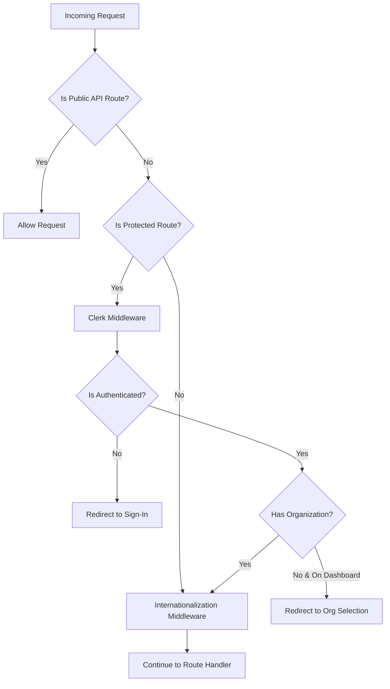
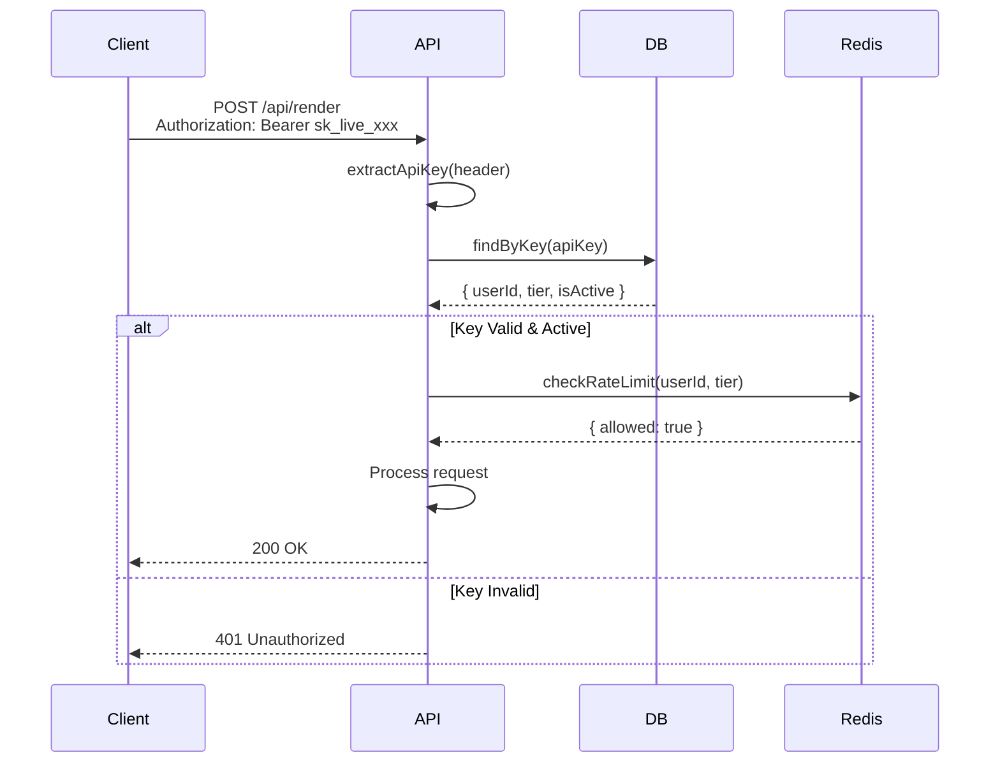
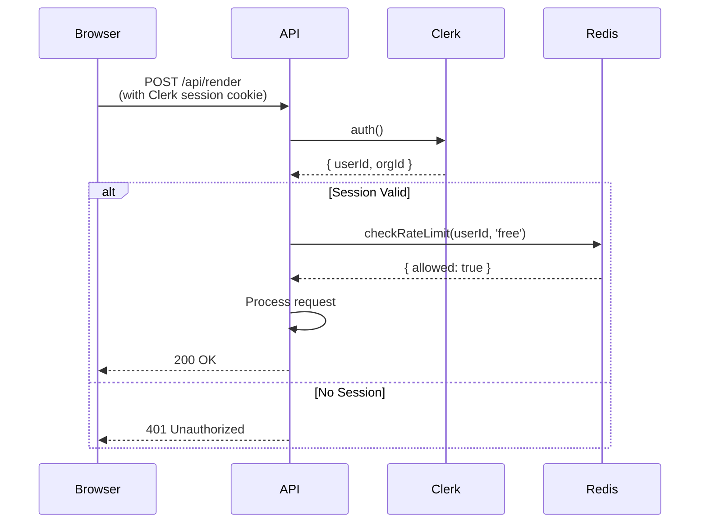

# Middleware Authentication & Route Protection

## Overview

CrawlReady uses Next.js middleware to protect routes and manage authentication through Clerk. The middleware implements a hybrid approach that supports both Clerk session-based authentication and API key authentication, depending on the route and context.

## Architecture



## Route Protection Strategy

### 1. Public API Routes (No Authentication)

These routes are completely public and bypass all authentication:

```typescript
const publicApiRoutes = [
  '/api/check-crawler',    // Bot detection endpoint
  '/api/check-schema',     // Schema validation endpoint
  '/api/waitlist',         // Waitlist signup
  '/api/waitlist/count',   // Waitlist count
];
```

**Why these are public:**
- **check-crawler**: Must be accessible to bots for detection testing
- **check-schema**: Public utility for schema validation
- **waitlist**: Marketing/signup endpoints need public access

### 2. Protected Routes (Clerk Session Required)

These routes require a valid Clerk session (user must be signed in):

```typescript
const isProtectedRoute = createRouteMatcher([
  '/dashboard(.*)',           // All dashboard routes
  '/:locale/dashboard(.*)',   // Localized dashboard routes
  '/onboarding(.*)',          // Onboarding flow
  '/:locale/onboarding(.*)',  // Localized onboarding
  '/api/admin(.*)',           // Admin API endpoints
  '/:locale/api/admin(.*)',   // Localized admin APIs
]);
```

**Protection mechanism:**
- Clerk middleware checks for valid session
- Unauthenticated users redirected to sign-in page
- Organization requirement enforced for dashboard access

### 3. Dual Authentication Routes (API Key OR Clerk Session)

These routes handle authentication internally and accept either method:

```typescript
// Routes that implement dual authentication
[
  '/api/render',              // Pre-render page endpoint
  '/api/status/:jobId',       // Job status checking
  '/api/cache',               // Cache management
  '/api/user/*',              // User-scoped endpoints
]
```

**Why dual authentication:**
- **External integrations**: Need API key access (headless, CI/CD)
- **Dashboard users**: Need session-based access (browser, UI)
- **Flexibility**: Same endpoints work in both contexts

## Middleware Logic Flow

### Step 1: Public API Route Check

```typescript
if (publicApiRoutes.includes(request.nextUrl.pathname)) {
  return NextResponse.next();
}
```

Early exit for public routes - no authentication required.

### Step 2: Protected Route Detection

```typescript
if (
  request.nextUrl.pathname.includes('/sign-in')
  || request.nextUrl.pathname.includes('/sign-up')
  || isProtectedRoute(request)
) {
  return clerkMiddleware(async (auth, req) => {
    // ... Clerk authentication logic
  })(request, event);
}
```

Routes matching the protected pattern invoke Clerk middleware.

### Step 3: Authentication & Authorization

Within Clerk middleware:

```typescript
if (isProtectedRoute(req)) {
  const locale = req.nextUrl.pathname.match(/(\/.*)\/dashboard/)?.at(1) ?? '';
  const signInUrl = new URL(`${locale}/sign-in`, req.url);

  await auth.protect({
    unauthenticatedUrl: signInUrl.toString(),
  });
}
```

**Key behaviors:**
- `auth.protect()` enforces authentication
- Locale-aware sign-in redirects
- Preserves intended destination after sign-in

### Step 4: Organization Validation

```typescript
const authObj = await auth();

if (
  authObj.userId
  && !authObj.orgId
  && req.nextUrl.pathname.includes('/dashboard')
  && !req.nextUrl.pathname.endsWith('/organization-selection')
) {
  const orgSelection = new URL('/onboarding/organization-selection', req.url);
  return NextResponse.redirect(orgSelection);
}
```

**Organization requirement:**
- Dashboard requires organization membership
- Users without org redirected to selection page
- Prevents accessing dashboard in invalid state

### Step 5: Internationalization

```typescript
return intlMiddleware(req);
```

All authenticated requests pass through i18n middleware for locale handling.

## Dual Authentication Implementation

Render APIs (`/api/render`, `/api/status`, `/api/cache`) are **excluded from middleware protection** because they implement their own dual authentication logic:

### Why Excluded from Middleware?

1. **API keys cannot pass through Clerk middleware** - Clerk middleware expects session tokens, not API keys
2. **Different authentication strategies** - Need to check API key first, then fall back to Clerk session
3. **Rate limiting varies** - API key users have different rate limits than session users

### How Dual Auth Works

Each render API route implements this pattern:

```typescript
export async function POST(request: NextRequest) {
  // 1. Try to authenticate with either method
  const authContext = await authenticateRequest(request);
  
  if (!authContext) {
    return unauthorized('Provide API key OR sign in with Clerk');
  }
  
  // 2. authContext contains:
  //    - userId: Clerk user ID (from API key owner or session)
  //    - orgId: Organization ID (if applicable)
  //    - authMethod: 'api_key' | 'clerk_session'
  //    - tier: User's service tier
  
  // 3. Rate limiting based on auth method
  const rateLimitResult = await checkRateLimit(authContext);
  
  // ... continue with business logic
}
```

### API Key Authentication Flow



### Clerk Session Authentication Flow



## Admin API Protection

Admin APIs (`/api/admin/*`) have **two layers of protection**:

### Layer 1: Middleware (Clerk Session Required)

```typescript
'/api/admin(.*)'  // Protected by middleware
```

Ensures user is authenticated via Clerk before reaching the route.

### Layer 2: Role-Based Access Control

```typescript
export async function POST(request: NextRequest) {
  const { userId } = await requireAdminRole();
  // Only org:admin role can proceed
}
```

**Role verification:**
- Checks `orgRole === 'org:admin'`
- Non-admin users get 403 Forbidden
- Admin users can manage API keys globally

## User API Protection

User APIs (`/api/user/*`) implement **user-scoped operations**:

```typescript
export async function GET(request: NextRequest) {
  const authContext = await getClerkUserContext();
  
  if (!authContext) {
    return unauthorized();
  }
  
  // Query only this user's data
  const apiKeys = await apiKeyQueries.findByUserId(db, authContext.userId);
  
  return success({ keys: apiKeys });
}
```

**Data isolation:**
- Users can only access their own API keys
- Users can only see their own rendered pages
- Users can only view their own usage statistics

## Common Issues & Troubleshooting

### Issue: "Unable to find next-intl locale"

**Cause:** Middleware didn't run because route was prematurely returned.

**Solution:** Ensure `intlMiddleware(req)` is called for all protected routes:

```typescript
// ✅ Correct
return intlMiddleware(req);

// ❌ Wrong - returns early
return NextResponse.next();
```

### Issue: API key authentication returns 401

**Cause:** Route is protected by middleware before API key can be checked.

**Solution:** Add route to `publicApiRoutes` or implement dual auth internally:

```typescript
const publicApiRoutes = [
  // ... other routes
  '/api/render',  // Now handles auth internally
];
```

### Issue: Dashboard redirects to org selection repeatedly

**Cause:** Organization ID not properly set or detected.

**Solution:** Check that:
1. User has selected an organization
2. `orgId` is present in `auth()` result
3. Route excludes `/organization-selection` endpoint

### Issue: Rate limiting not working for Clerk users

**Cause:** Rate limit key not properly constructed for session-based auth.

**Solution:** Use `checkRateLimit()` helper which handles both auth methods:

```typescript
const rateLimitResult = await checkRateLimit(authContext);
// Automatically uses correct key format based on authMethod
```

## Security Considerations

### 1. API Key Storage

- Keys hashed with SHA-256 before database storage
- Plain keys shown only once at generation
- Keys transmitted only via HTTPS (Authorization header)

### 2. Session Security

- Clerk handles session token encryption
- HTTPOnly cookies prevent XSS attacks
- SameSite=Lax prevents CSRF

### 3. Rate Limiting

- Per-user and per-API-key limits enforced
- Redis-based sliding window implementation
- Prevents abuse from both auth methods

### 4. SSRF Protection

All render endpoints validate URLs before processing:

```typescript
await validateUrlSecurity(url);
// Blocks private IPs, localhost, internal networks
```

## Testing Authentication

### Test Clerk Session Authentication

```bash
# 1. Sign in via browser to get session cookie
# 2. Make API call with cookie
curl -X POST http://localhost:3000/api/render \
  -H "Content-Type: application/json" \
  -d '{"url": "https://example.com"}' \
  --cookie "clerk_session=..."
```

### Test API Key Authentication

```bash
curl -X POST http://localhost:3000/api/render \
  -H "Authorization: Bearer sk_live_xxx" \
  -H "Content-Type: application/json" \
  -d '{"url": "https://example.com"}'
```

### Test Admin Access

```bash
# Should return 403 if not admin
curl http://localhost:3000/api/admin/keys \
  --cookie "clerk_session=..."
```

## Best Practices

1. **Always use helpers** for authentication checks (avoid reimplementing auth logic)
2. **Test both auth methods** for dual-auth endpoints
3. **Scope data to users** - never return data from other users
4. **Log auth failures** for security monitoring
5. **Use typed AuthContext** to avoid bugs

## References

- [Clerk Middleware Docs](https://clerk.com/docs/references/nextjs/clerk-middleware)
- [Next.js Middleware](https://nextjs.org/docs/app/building-your-application/routing/middleware)
- [CrawlReady Functional Spec](./specs/functional-spec.md)

